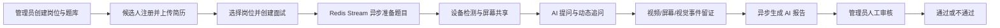
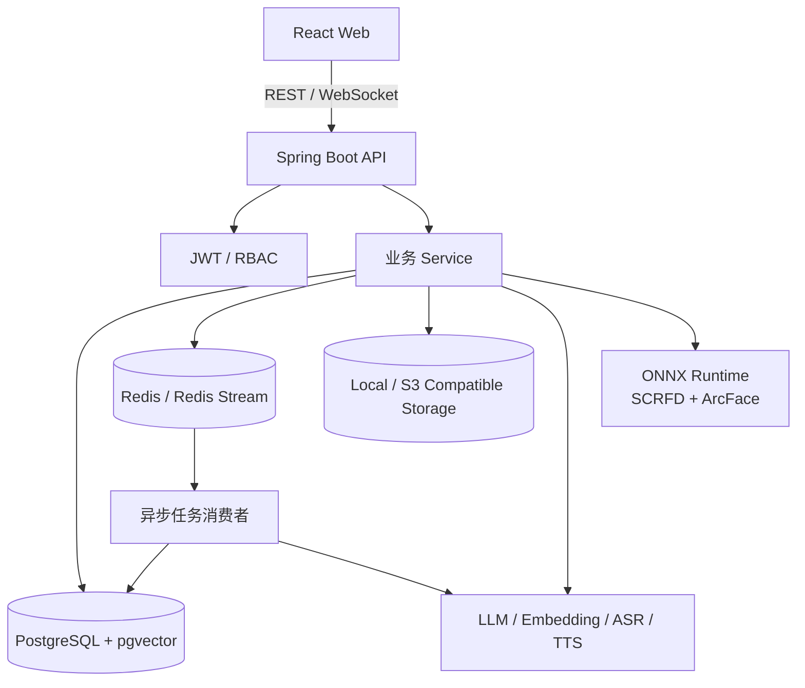

# AI Interview Platform

> 面向企业招聘场景的 AI 视频面试平台：从简历与岗位匹配、AI 出题和动态追问，到视频留证、结构化报告与人工审核，形成完整的候选人初筛闭环。

[](https://openjdk.org/projects/jdk/21/)
[](https://spring.io/projects/spring-boot)
[](https://react.dev/)
[](https://github.com/pgvector/pgvector)
[](LICENSE)

## 项目简介

AI Interview Platform 是一套前后端分离的企业招聘面试系统。管理员可以维护岗位、题库和候选人，候选人上传简历后参加正式 AI 面试。系统根据岗位要求与候选人经历异步准备问题，并结合真实回答动态追问；面试过程中持续记录回答、视频分片、屏幕证据和客观视觉事件，最终生成报告供管理员人工审核。

本项目坚持“AI 辅助、人工决策”：AI 报告和监考事件仅作为审核材料，不自动给出录用结论。

## 核心能力

### 候选人端

- 账号密码、短信验证码登录，预留微信和 QQ OAuth 接入
- PDF、DOC、DOCX、TXT 简历上传、解析、去重和管理
- 浏览开放岗位、查看面试任务和历史审核状态
- 摄像头、麦克风、屏幕共享与全屏环境检查
- 文字或语音答题、TTS 读题、实时 ASR 转写
- 岗位固定题与简历定制题组合，基于题目能力覆盖状态动态追问
- 面试中断恢复与视频分片断点补传

### 管理员端

- 用户启用、禁用及测试账号管理
- 招聘岗位、岗位描述、固定题库与面试任务管理
- 候选人简历、回答、视频、屏幕截图和视觉事件查看
- AI 面试报告查看与通过/不通过人工审核
- Chat、Embedding、出题模型、ASR、TTS Provider 配置
- 知识库、RAG 问答、面试日程和异步任务监控

### 平台能力

- 多 LLM Provider 路由，兼容 DashScope、Kimi、DeepSeek、GLM、LM Studio 等 OpenAI 兼容接口
- 单实例 Task-aware Router，根据延迟 EWMA、错误率和剩余容量动态选择 Provider
- Provider 熔断、半开恢复、跨 Provider Failover 与任务级并发隔离
- 单次 LLM 调用同时完成回答分析、覆盖状态更新和下一问生成
- Redis Stream 驱动的出题、报告、知识库向量化和语音评估任务
- 任务幂等、分布式锁、失败重试、Pending 接管和 Dead Letter Stream
- PostgreSQL + pgvector 语义检索，支持知识库 RAG
- Redis Lua 滑动窗口限流，支持 GLOBAL、IP、USER 多维度策略
- 本地 ONNX Runtime 推理，使用 SCRFD 与 ArcFace 进行人脸检测和身份一致性比对
- 本地文件系统或 S3 兼容对象存储

## 业务流程



正式面试状态依次为：

```text
INIT → DEVICE_CHECK → READY → QUESTIONING → ANSWERING
     → EVALUATING → QUESTIONING / FINISHED
```

候选人的业务审核状态为 `INCOMPLETE`、`UNDER_MANUAL_REVIEW`、`PASSED` 或 `REJECTED`。

## 系统架构



后端采用按功能分包的分层结构：`Controller → Service → Repository`，公共能力与基础设施独立放置；耗时任务通过 Redis Stream 与请求链路解耦。

## 技术栈

| 领域 | 技术 |
| --- | --- |
| 后端 | Java 21、Spring Boot 4.0.1、Spring Security、Spring Data JPA、WebSocket |
| AI | Spring AI 2.0、Structured Output、RAG、多 Provider 路由 |
| 前端 | React 18、TypeScript、Vite、Tailwind CSS 4、Recharts |
| 数据 | PostgreSQL、pgvector、Redis、Redisson、Redis Stream |
| 文件 | Apache Tika、AWS S3 SDK、iText 8 |
| 视觉与语音 | ONNX Runtime、SCRFD、ArcFace、Qwen ASR/TTS |
| 工程化 | Gradle、pnpm、Docker Compose、GitHub Actions、JUnit 5、JaCoCo |

## 项目结构

```text
interview-guide/
├── app/
│   ├── src/main/java/interview/guide/
│   │   ├── common/                  # 通用配置、异常、限流、AI 与异步模板
│   │   ├── infrastructure/          # 文件、对象存储、Redis、Mapper、PDF
│   │   └── modules/                 # 认证、招聘、简历、面试、知识库等业务模块
│   └── src/main/resources/
│       ├── prompts/                 # StringTemplate Prompt
│       ├── scripts/                 # Redis Lua 脚本
│       └── application.yml
├── frontend/                        # React + TypeScript 前端
├── docs/                            # 架构、流程与源码导读
├── models/vision/                   # 本地 ONNX 模型（不提交 Git）
├── performance/                     # 性能测试
├── docker-compose.dev.yml           # 本地开发依赖
├── docker-compose.prod.yml          # 生产部署编排
└── docker-compose.yml                # 全栈容器化演示环境
```

第一次阅读代码可从[项目流程导读](docs/current-project-flow/README.md)开始。

## 快速开始

### 环境要求

- JDK 21
- Node.js 20+
- pnpm 10+
- Docker 与 Docker Compose（推荐，用于启动 PostgreSQL、Redis 和 RustFS）

### 1. 获取项目

```bash
git clone <your-repository-url>
cd interview-guide
```

### 2. 启动开发依赖

```bash
docker compose -f docker-compose.dev.yml up -d
```

该命令会启动 PostgreSQL 16 + pgvector、Redis 7 和 RustFS。使用本地存储时无需配置 RustFS；使用 S3 模式时，请访问 <http://localhost:9001> 创建 `interview-guide` Bucket。

### 3. 配置环境变量

在项目根目录创建 `.env`。以下是可运行的最小开发配置，请替换其中的密钥：

```dotenv
POSTGRES_HOST=localhost
POSTGRES_PORT=5432
POSTGRES_DB=interview_guide
POSTGRES_USER=postgres
POSTGRES_PASSWORD=123456

REDIS_HOST=localhost
REDIS_PORT=6379

APP_STORAGE_PROVIDER=local
APP_STORAGE_LOCAL_DIR=./data/storage

APP_AI_DEFAULT_PROVIDER=dashscope
APP_AI_DEFAULT_EMBEDDING_PROVIDER=dashscope
AI_BAILIAN_API_KEY=replace_with_your_dashscope_api_key
AI_MODEL=qwen3.5-flash

APP_AUTH_ADMIN_USERNAME=admin
APP_AUTH_ADMIN_PASSWORD=replace_with_a_strong_password
APP_AUTH_JWT_SECRET=replace_with_at_least_32_random_characters
APP_AUTH_IDENTITY_ENCRYPTION_KEY=replace_with_another_random_secret

APP_SMS_PROVIDER=noop
APP_SMS_NOOP_CODE=123456
APP_SMS_EXPOSE_CODE=true

APP_INTERVIEW_VISION_PROVIDER=mock
APP_VOICE_ASR_PROVIDER=qwen
APP_VOICE_TTS_PROVIDER=qwen
```

`.env` 已加入 Git 忽略列表。请勿提交真实 API Key、数据库密码或认证密钥。

### 4. 启动后端

Windows PowerShell：

```powershell
chcp 65001 | Out-Null
.\gradlew.bat :app:bootRun
```

Linux / macOS：

```bash
./gradlew :app:bootRun
```

后端启动后可访问：

- API：<http://localhost:8080>
- Swagger UI：<http://localhost:8080/swagger-ui.html>
- OpenAPI JSON：<http://localhost:8080/v3/api-docs>

### 5. 启动前端

```bash
cd frontend
corepack enable
pnpm install
pnpm dev
```

浏览器访问 <http://localhost:5173>，使用 `.env` 中配置的管理员账号登录后台。

## 启用真实人脸核验

开发环境默认使用 `mock` 视觉 Provider。启用 ONNX 推理前，请自行准备符合许可要求的模型文件：

```text
models/vision/
├── scrfd_500m_kps.onnx
└── w600k_mbf.onnx
```

然后修改 `.env`：

```dotenv
APP_INTERVIEW_VISION_ENABLED=true
APP_INTERVIEW_VISION_PROVIDER=onnx
APP_INTERVIEW_VISION_SCRFD_MODEL=models/vision/scrfd_500m_kps.onnx
APP_INTERVIEW_VISION_ARCFACE_MODEL=models/vision/w600k_mbf.onnx
APP_INTERVIEW_VISION_IDENTITY_THRESHOLD=0.5
```

模型文件不会提交到 Git。当前推理使用 ONNX Runtime CPU，不强制要求独立显卡。

## Docker 部署

全栈演示环境：

```bash
docker compose up -d --build
```

启动完成后访问 <http://localhost>。

生产编排示例：

```bash
cp .env.production.example .env.production
# 编辑 .env.production，替换全部占位配置
docker compose -f docker-compose.prod.yml up -d --build
```

生产编排默认将前端绑定到 `127.0.0.1:3000`、后端绑定到 `127.0.0.1:8080`，应在其前方配置 Nginx、Caddy 或云负载均衡，并启用 HTTPS。

> 不要在包含重要数据的环境中执行 `docker compose down -v`，该命令会删除 Compose 数据卷。

## 测试与构建

```bash
# 后端测试
./gradlew :app:test

# 测试、覆盖率报告和覆盖率校验
./gradlew test jacocoTestReport jacocoTestCoverageVerification

# 后端可执行 JAR
./gradlew :app:bootJar

# 前端类型检查与生产构建
cd frontend
pnpm build
```

GitHub Actions 会在 Push 和 Pull Request 时运行后端测试、JaCoCo 校验以及前端构建。

## 主要 API

| 模块 | 路径 |
| --- | --- |
| 认证 | `/api/auth/**` |
| 简历 | `/api/resumes/**` |
| 候选人岗位与任务 | `/api/interviewee/jobs/**`、`/api/interviewee/assignments/**` |
| 正式面试 | `/api/interview/**`、`/api/interviews/**` |
| 招聘管理 | `/api/admin/jobs/**`、`/api/admin/interview-assignments/**` |
| 报告与审核 | `/api/admin/interviews/**`、`/api/hr/interview-results/**` |
| 知识库 | `/api/knowledgebase/**` |
| 面试日程 | `/api/interview-schedule/**` |
| 模型配置 | `/api/llm-provider/**` |
| LLM 路由状态 | `/api/admin/llm-router/status` |
| 异步任务监控 | `/api/admin/async-tasks/**` |

具体请求参数与响应结构以 Swagger UI 为准。所有业务接口统一返回 `Result<T>`；业务异常由全局异常处理器转换为统一错误码。

## 安全与隐私

- 生产环境必须更换管理员密码、JWT 密钥、身份信息加密密钥和 Provider 配置加密密钥
- 生产环境关闭开发短信验证码回显：`APP_SMS_EXPOSE_CODE=false`
- 简历、面试音视频与人脸特征属于敏感数据，应设置访问控制、保留期限和删除策略
- 摄像头、麦克风和屏幕采集必须取得候选人明确授权
- 视觉事件只记录客观现象，不用于推断性格、诚信、情绪或直接作出录用决定
- 建议在公网部署时启用 HTTPS、最小权限数据库账号、私有 Bucket 和密钥托管服务

## 文档

- [项目流程导读](docs/current-project-flow/README.md)
- [语音面试架构](docs/voice-interview-architecture.md)

## License

本项目基于 [GNU Affero General Public License v3.0](LICENSE) 开源。通过网络向用户提供修改后的服务时，请遵守 AGPL-3.0 的源代码公开要求。
