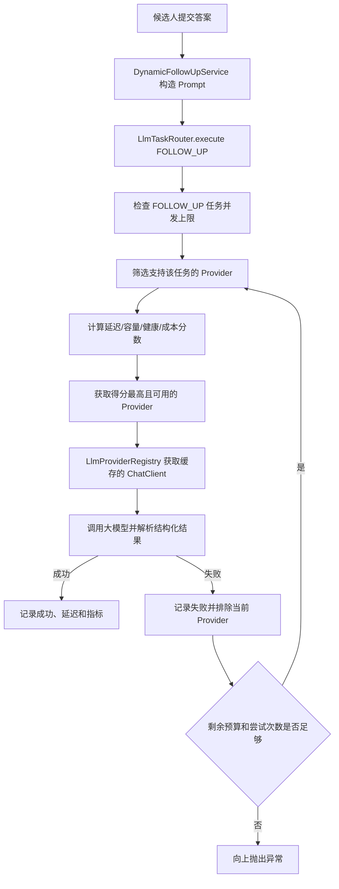

# LLM 动态路由与高可用实现说明

> 适合第一次阅读该项目代码的人。本文从一次真实的动态追问请求出发，说明系统如何选择模型、记录健康状态、失败切换、熔断恢复，以及当前仍然存在的限制。

## 1. 先说结论

当前项目已经实现并接入了一个统一的 LLM 路由框架，包括：

- 按任务类型区分动态追问、面试出题和报告生成。
- 按延迟、剩余容量、近期错误率和成本计算 Provider 分数。
- 限制每类任务和每个 Provider 的并发数。
- 一次调用失败后，在时间预算允许时切换到其他 Provider。
- 通过 `CLOSED / OPEN / HALF_OPEN` 状态完成熔断和恢复探测。
- 记录调用次数、调用结果和响应延迟指标。
- 在管理员接口中查看每个 Provider 的实时状态。

但它目前还不能等同于“完整的跨厂商生产级高可用”：

- 默认只启用了 `dashscope` 和 `dashscope-question`，二者通常仍属于同一云厂商。
- Kimi、DeepSeek、GLM 等跨厂商备用 Provider 默认未启用。
- Provider 健康状态保存在单个应用实例内存中，多实例之间不会同步。
- 熔断 Provider 的候选过滤顺序存在一个边界问题，见第 11 节。

## 2. 需要先认识的组件

| 组件 | 职责 | 关键文件 |
|---|---|---|
| `LlmTaskRouter` | 选择 Provider、评分、并发隔离、失败切换、熔断和监控 | `common/ai/routing/LlmTaskRouter.java` |
| `LlmRouterProperties` | 接收 `application.yml` 中的路由配置 | `common/config/LlmRouterProperties.java` |
| `LlmTaskType` | 定义追问、出题、报告等任务类型 | `common/ai/routing/LlmTaskType.java` |
| `LlmProviderRegistry` | 根据 Provider ID 创建并缓存 `ChatClient` | `common/ai/LlmProviderRegistry.java` |
| `DynamicFollowUpService` | 动态追问业务入口 | `modules/interview/service/DynamicFollowUpService.java` |
| `InterviewPlannerService` | 面试出题业务入口 | `modules/interview/service/InterviewPlannerService.java` |
| `EvaluateStreamConsumer` | 异步报告生成入口 | `modules/interview/listener/EvaluateStreamConsumer.java` |
| `LlmRouterAdminController` | 管理员查看 Provider 状态 | `modules/llmprovider/controller/LlmRouterAdminController.java` |

其中最容易混淆的是下面两个类：

```text
LlmTaskRouter       决定“这次应该调用哪个 Provider”
LlmProviderRegistry 根据 Provider ID 返回“真正可调用的 ChatClient”
```

路由器不会直接发送 HTTP 请求，Registry 也不会负责动态评分，两者分工不同。

## 3. 一次动态追问的完整流程



动态追问中的关键调用如下：

```java
taskRouter.execute(
    LlmTaskType.FOLLOW_UP,
    resolveProvider(llmProvider),
    routedProvider -> structuredOutputInvoker.invokeOnce(
        llmProviderRegistry.getPlainChatClient(routedProvider),
        systemPrompt,
        userPrompt,
        outputConverter,
        followUpOptions,
        ...
    )
);
```

这段代码可以分成三部分理解：

1. `FOLLOW_UP` 告诉路由器这是实时追问任务。
2. `resolveProvider(...)` 提供首选 Provider，但不保证一定使用它。
3. Lambda 中的 `routedProvider` 是路由器最终选出的 Provider。

出题和报告使用相同模式，只是任务类型分别改为 `QUESTION_GENERATE` 和 `REPORT`。

## 4. 为什么要区分任务类型

当前定义了四种任务：

```java
public enum LlmTaskType {
  FOLLOW_UP,
  QUESTION_GENERATE,
  REPORT,
  GENERAL
}
```

它们的要求不同：

| 任务 | 主要要求 | 默认偏好 |
|---|---|---|
| `FOLLOW_UP` | 候选人正在等待，响应速度优先 | `FAST` |
| `QUESTION_GENERATE` | 题目质量和岗位匹配度优先 | `STRONG` |
| `REPORT` | 分析质量优先，可接受更长耗时 | `STRONG` |
| `GENERAL` | 未细分的通用任务 | 使用默认策略 |

每种任务拥有独立的总时间预算、最大尝试次数和并发上限。这样可以避免大量后台报告任务把实时追问资源全部占满。

当前主要配置为：

| 任务 | 总时间预算 | 目标延迟 | 最大 Provider 尝试 | 任务最大并发 |
|---|---:|---:|---:|---:|
| 动态追问 | 2 秒 | 1.5 秒 | 2 | 60 |
| 面试出题 | 90 秒 | 8 秒 | 2 | 20 |
| 报告生成 | 2 分钟 | 15 秒 | 2 | 20 |

注意：总时间预算是路由器决定是否继续尝试的依据，不一定等同于底层 HTTP 客户端的强制超时时间。

## 5. Provider 候选池如何产生

路由器会遍历配置中的 Provider，只保留满足条件的候选者：

```java
if (!profile.isEnabled()
    || excluded.contains(providerId)
    || !supports(profile, taskType)) {
  return;
}
```

条件分别表示：

- Provider 已启用。
- Provider 没有在本次请求的前一次尝试中失败。
- Provider 支持当前任务类型。
- 预测延迟没有超过任务剩余时间预算。

当前 Provider 配置概况：

| Provider | 默认状态 | 等级 | 支持任务 |
|---|---|---|---|
| `dashscope` | 开启 | `FAST` | 追问、出题、报告 |
| `dashscope-question` | 开启 | `STRONG` | 追问、出题、报告 |
| `kimi` | 关闭 | `STRONG` | 出题、报告 |
| `deepseek` | 关闭 | `STRONG` | 出题、报告 |
| `glm` | 关闭 | `STRONG` | 出题、报告 |
| `lmstudio` | 关闭 | `FAST` | 追问、出题 |

正常情况下，追问倾向于选择 `dashscope`，出题和报告倾向于选择 `dashscope-question`。

## 6. 路由评分如何计算

代码中的综合分数可以简化成：

```text
总分 =
  延迟权重 × 延迟得分
  + 容量权重 × 容量得分
  + 健康权重 × 健康得分
  + 成本权重 × 成本得分
  + 模型等级奖励
  + 首选 Provider 奖励
```

### 6.1 延迟得分

近期延迟通过 EWMA（指数加权移动平均）更新：

```text
新 EWMA = 0.2 × 本次延迟 + 0.8 × 历史 EWMA
```

对应代码逻辑：

```java
latencyEwmaNanos = latencyEwmaNanos == 0.0
    ? latencyNanos
    : alpha * latencyNanos + (1.0 - alpha) * latencyEwmaNanos;
```

它比普通平均数更关注近期状态。某个 Provider 最近突然变慢时，评分会较快下降。

### 6.2 容量得分

```text
容量得分 = 1 - 当前请求数 / Provider 最大并发数
```

例如：

- Provider A 当前为 `5/50`，剩余容量较多。
- Provider B 当前为 `28/30`，接近满载。
- 其他条件接近时，A 的分数会更高。

### 6.3 健康得分

每个 Provider 保存最近最多 50 次成功或失败结果：

```text
近期错误率 = 失败次数 / 窗口样本数
健康得分 = 1 - 近期错误率
```

### 6.4 成本得分

```text
成本得分 = 1 / costWeight
```

只有任务策略中的 `cost-weight` 大于 0 时，它才会真正影响最终结果。当前追问的成本权重为 0，出题和报告更关注健康度与成本。

### 6.5 首选 Provider 和模型等级

- Provider 等于业务传入的首选 Provider 时，增加 `0.05`。
- Provider 等级符合任务偏好时，再增加 `0.05`。

这两个奖励只表达“倾向”，真正的选择仍会受健康、延迟和负载影响。

## 7. 并发治理如何实现

系统有两层并发限制。

### 7.1 任务级并发

```java
AtomicInteger taskCounter = taskInFlight.computeIfAbsent(
    taskType,
    ignored -> new AtomicInteger());
```

例如动态追问最多允许 60 个路由任务同时执行。超过后快速返回 `AI_RATE_LIMIT_EXCEEDED`，避免无限堆积导致服务雪崩。

### 7.2 Provider 级并发

每个 Provider 的运行状态中还维护 `inFlight`：

```java
if (inFlight.get() >= profile.getMaxConcurrency()) return false;
inFlight.incrementAndGet();
```

任务级限制保护某条业务链路，Provider 级限制保护外部模型实例。二者解决的问题不同。

## 8. 失败切换如何实现

一次任务最多循环 `maxProviderAttempts` 次：

```java
for (int attempt = 1;
     attempt <= policy.getMaxProviderAttempts();
     attempt++) {
  Selection selection = select(...);
  try {
    return operation.execute(selection.providerId());
  } catch (Exception e) {
    excluded.add(selection.providerId());
  }
}
```

假设第一次选择 `dashscope`：

1. 调用成功：直接返回。
2. 调用失败：记录失败，把 `dashscope` 加入本次请求的 `excluded`。
3. 检查总预算和最小重试预算。
4. 时间足够时重新评分，选择其他 Provider。
5. 达到最大尝试次数后，抛出最后一次异常。

这里的 `excluded` 只针对当前这一次业务请求，不会永久禁用 Provider。长期禁用由熔断器负责。

## 9. 熔断和半开恢复

每个 Provider 都维护独立状态：

```text
CLOSED --失败达到阈值--> OPEN
OPEN --冷却 30 秒--> HALF_OPEN
HALF_OPEN --探测成功--> CLOSED
HALF_OPEN --探测失败--> OPEN
```

### 9.1 CLOSED

正常状态，可以接收请求。

### 9.2 OPEN

满足以下任一条件会打开熔断器：

- 连续失败达到 5 次。
- 最近至少有 20 个样本，并且错误率达到 30%。
- 半开探测再次失败。

### 9.3 HALF_OPEN

熔断冷却 30 秒后，允许最多 2 个探测调用。成功达到 2 次后恢复到 `CLOSED`；探测失败则重新回到 `OPEN`。

这可以避免一个已经故障的 Provider 被持续请求，也允许它恢复后自动重新加入。

## 10. Registry 和 ChatClient 缓存

路由器选出的是字符串形式的 Provider ID，例如 `dashscope-question`。随后业务代码调用：

```java
llmProviderRegistry.getPlainChatClient(routedProvider)
```

Registry 使用 `ConcurrentHashMap` 缓存客户端：

```java
return clientCache.computeIfAbsent(
    id + ":plain",
    key -> createPlainChatClient(id)
);
```

因此正常情况下不会为每次追问重新创建 `ChatClient`，也不会每次都从数据库查询默认 Provider。路由负责选择 ID，Registry 负责复用客户端。

## 11. 当前实现的重要限制

### 11.1 熔断候选的筛选顺序存在边界问题

当前代码先检查候选列表中是否存在任务偏好的模型等级，然后删除其他等级；之后才调用 `tryAcquire()` 判断熔断和并发状态。

可能出现：

```text
FOLLOW_UP 偏好 FAST
dashscope 是 FAST，但已处于 OPEN
dashscope-question 是 STRONG，并且可用
        ↓
因为候选列表里仍然存在 FAST，先删除 STRONG
        ↓
再发现 FAST 已熔断，无法获取
        ↓
本次没有选到 Provider
```

第一次实际调用失败后，由于失败 Provider 会进入本次请求的 `excluded`，第二次尝试仍可能切换成功；但后续请求面对已经 `OPEN` 的 Provider 时可能无法正确降级。

建议调整为：先排除熔断、并发已满等不可获取的 Provider，再应用等级偏好；或者首选等级全部不可用时，显式回退到其他等级。

### 11.2 尚未实现真正的跨厂商容灾

当前两个启用项通常仍属于 DashScope。它们可以处理部分单模型问题，但不能覆盖：

- DashScope 整体故障。
- 同一账号额度耗尽。
- 同一个 API Key 被限流。
- 云厂商区域网络异常。

要形成跨厂商容灾，需要启用至少一个 DeepSeek、Kimi 或 GLM Provider，并完成真实故障切换测试。

### 11.3 健康状态只保存在本机

`states` 是本地 `ConcurrentHashMap`。多实例部署时，各实例的错误率和熔断状态互不共享。

这不一定是错误：许多熔断器本来就按实例隔离。但如果希望管理员看到全局健康状态，可以通过 Redis 汇总状态或通过 Prometheus 汇总指标。

### 11.4 异常没有精细分类

当前基本上把所有 `Exception` 都计为 Provider 失败并尝试切换。更完善的设计应区分：

| 异常 | 建议处理 |
|---|---|
| 网络超时、连接失败、服务端 5xx | 记录 Provider 失败并切换 |
| 429 限流 | 短期退避、降低并发或切换 |
| 401/403 | 立即标记配置故障并告警 |
| 结构化输出解析失败 | 可换模型或有限重试 |
| Prompt/业务参数错误 | 不应污染 Provider 健康度 |
| 用户业务异常 | 直接返回，不应切换 Provider |

### 11.5 缺少跨厂商故障注入结果

已有单元测试覆盖：

- 首个 Provider 失败后切换其他 Provider。
- 按任务类型过滤 Provider。
- 时间预算耗尽后不再重试。
- 任务并发隔离。
- 熔断打开及半开恢复。

但还需要在云端测试：超时、429、5xx、无效 API Key、Provider 整体不可达等真实场景。

## 12. 监控与管理员状态接口

路由器通过 Micrometer 记录：

```text
app.ai.router.calls
app.ai.router.latency
```

指标标签包括：

- `task`：任务类型。
- `provider`：实际 Provider。
- `outcome`：`success` 或 `failure`。

管理员可以调用：

```http
GET /api/admin/llm-router/status
```

响应中可以看到：

- 熔断状态。
- EWMA 延迟。
- 近期错误率。
- 当前并发数和最大并发数。
- 连续失败次数。
- 最近成功时间。

该接口要求 `ADMIN` 权限，并带有用户维度限流。

## 13. 建议阅读顺序

如果还不熟悉代码，建议按下面顺序阅读：

1. `LlmTaskType.java`：先认识有哪些任务。
2. `application.yml` 中的 `app.ai.router`：了解 Provider 和任务策略。
3. `DynamicFollowUpService.java`：看业务如何把调用交给路由器。
4. `LlmTaskRouter.execute()`：理解总入口和任务并发控制。
5. `LlmTaskRouter.select()` 与 `score()`：理解候选筛选和评分。
6. `ProviderRuntimeState`：理解 EWMA、错误窗口和熔断状态。
7. `LlmProviderRegistry.getPlainChatClient()`：理解真正的模型客户端从哪里来。
8. `LlmTaskRouterTest.java`：通过测试场景验证自己的理解。

## 14. 面试时可以怎样介绍

可以用下面这段相对准确的表述：

> 项目把动态追问、异步出题和报告生成统一抽象为不同 SLA 的 LLM 任务，通过路由层按照 EWMA 延迟、滑动窗口错误率和实时并发容量选择 Provider。单次调用失败后，在任务剩余预算内切换其他 Provider；连续失败或错误率超过阈值时打开熔断器，并通过半开探测自动恢复。同时对任务和 Provider 分别设置并发上限，避免后台长任务挤占实时追问资源。当前已经完成路由框架和核心业务接入，后续通过启用跨厂商 Provider 和故障注入验证进一步完善生产级高可用。

不要在尚未完成验证前表述为“已经实现完全无单点的跨厂商高可用”。更准确的说法是“实现了动态路由与故障转移框架，并预留跨厂商容灾能力”。

## 15. 关键源码索引

```text
app/src/main/java/interview/guide/common/ai/routing/
├── LlmTaskRouter.java              # 路由、评分、切换、熔断、指标
├── LlmTaskType.java                # 任务类型
├── ModelLevel.java                 # FAST / STRONG
└── CircuitState.java               # CLOSED / OPEN / HALF_OPEN

app/src/main/java/interview/guide/common/config/
└── LlmRouterProperties.java        # 路由配置映射

app/src/main/java/interview/guide/common/ai/
└── LlmProviderRegistry.java        # ChatClient 创建与缓存

app/src/main/java/interview/guide/modules/interview/
├── service/DynamicFollowUpService.java
├── service/InterviewPlannerService.java
└── listener/EvaluateStreamConsumer.java

app/src/main/java/interview/guide/modules/llmprovider/controller/
└── LlmRouterAdminController.java   # 管理员状态接口

app/src/test/java/interview/guide/common/ai/routing/
└── LlmTaskRouterTest.java          # 路由与熔断单元测试
```
